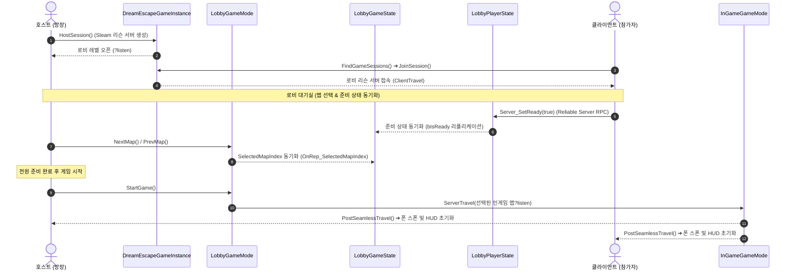
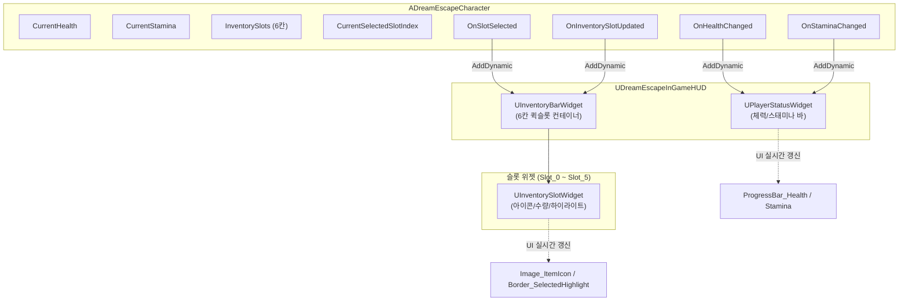

# Dream Escape

> 영원한 잠에 빠진 환자의 무의식으로 다이브해, 시야가 조각나는 극한 상황에서 동료의 목소리에 의존해 탈출하는 4인 코옵 심리 호러
> 
> 

---

### 1. 프로젝트 개요 (Project Overview)

* **장르:** 1인칭 협동 퍼즐 스릴러 (무의식 다이빙 · 다인용 방탈출 · 생존)


* **시점 / 플랫폼:** 1인칭(FPP) / PC (Steam, Windows 전용)


* **멀티플레이:** 최대 1~4인, 리슨 서버(Listen Server), 3D 거리 기반 근접 보이스챗


* **개발 체제 / 기간:** 1인 개발 / Alpha v0.1 기준 12주


* **타겟 성능:** FHD 기준 권장 사양 상옵 60FPS / 최소 사양 하옵 100FPS


---

### 2. 핵심 가치 및 가설 (Core USP & Validation)

* **USP-1. 무의식 동기화 장애 (Grid-Based Neural Occlusion)**
* 정신력이 임계치 이하로 떨어지면 16×9 UV 그리드 단위로 화면이 암전/화이트노이즈 처리됩니다.


* 플레이어가 시각 대신 환경음과 발소리 등 청각에 의존해 이동하도록 강제합니다.


* 가설 H1: 시야가 물리적으로 조각나는 경험이 단순한 불쾌감이 아닌 긍정적 긴장감으로 인지되는지 검증합니다.


* **USP-2. 근접 강제 기반 소셜 호러 (Proximity Social Horror)**
* 팀원과 20m 이내 유지 시 초당 0.1%씩 정신력이 감소하지만, 20m를 초과해 이격되면 초당 0.2%로 2배 가속 감소합니다.


* 생존을 위해 물리적인 대열 유지를 강제하며, 3D 거리 기반 음향으로 자연스러운 음성 협력을 유도합니다.


* 가설 H2: 제한된 시야 속에서 보이스챗을 통한 팀원 간 협동이 빈번히 일어나는지 검증합니다.


* **USP-3. 테마형 무의식 (Thematic Subconscious)**
* 환자의 트라우마와 결핍에 따라 꿈의 환경과 규칙이 달라집니다.


* 가설 H3: 환자별 상이한 규칙이 다회차 반복 플레이의 동기를 제공하는지 결합형 프로토타입으로 검증합니다.


---

### 3. 코어 게임플레이 시스템 (Core Gameplay & Mechanics)

**게임 루프 (Game Loop)**

* **마이크로 루프:** Idle $\rightarrow$ Explore(단서 상호작용) $\rightarrow$ Blinded(그리드 암전 및 질주 제한) $\rightarrow$ ForcedExit(정신력 0% 시 로비 강제 소환) / Escaping(붕괴 페이즈 탈출 질주)


* **매크로 루프:** 거점(병실) 대기 $\rightarrow$ 꿈속 다이브 $\rightarrow$ 악몽 정화(오브제 파괴) $\rightarrow$ 탈출(The Kick 붕괴 타임어택) $\rightarrow$ 결과 정산 $\rightarrow$ 거점 귀환


**정신력 4단계 (Sanity Phases)**


| 단계 | 정신력 범위 | 화면 연출 | 게임플레이 영향 |
| :--- | :--- | :--- | :--- |
| **Phase 1 (안정기)**[cite: 1] | 100% ~ 70%[cite: 1] | 정상 출력[cite: 1] | 제약 없음[cite: 1] |
| **Phase 2 (전조)**[cite: 1] | 70% ~ 30%[cite: 1] | 화면 가장자리 노이즈 침범 확대[cite: 1] | 가짜 발소리 및 환청 (Faking)[cite: 1] |
| **Phase 3 (시야 잠식)**[cite: 1] | 30% ~ 1%[cite: 1] | 암전 영역 확대, 터널 시야 (16x9 UV 그리드)[cite: 1] | 이동속도 디버프, 질주(Shift) 제한[cite: 1] |
| **Phase 4 (완전 붕괴)**[cite: 1] | 0%[cite: 1] | 조작 권한 박탈 (`DisableInput`)[cite: 1] | 강제 이탈 (Forced Exit) → 로비 소환 및 지원 역할 전환[cite: 1] |

**사망자 개입: 단말기 및 USB 물리 전송 시스템 (Forced Exit & USB Intervention)**

* **강제 이탈 (Forced Exit):** 정신력 0% 도달 시 탈락하는 대신 현실 병실(로비)로 강제 복귀하여 후방 지원 역할로 전환됩니다.


* **개별 모니터링 단말기:** 로비에 배치된 단말기들을 통해 살아있는 팀원들의 실시간 1인칭 뷰와 상태를 관전합니다 (단, 음성/채팅 소통은 차단됨).


* **USB 구매 및 전송:** 로비 상점에서 자원을 소모해 USB 형태의 아이템(회복약, 탄약/배터리 등)을 구매한 뒤, 지원할 생존자의 단말기에 꽂으면 Server RPC를 거쳐 꿈속 해당 팀원 주변에 실제 아이템이 물리 스폰됩니다.


* **승리 및 패배:** 맵 탐색을 통해 원인 단서를 찾아 퍼즐을 풀고 탈출구가 열렸을 때 생존자가 도달하면 승리하며, 전원이 강제 이탈되면 미션 실패로 종료됩니다.


---

### 4. 테마 및 레벨 디자인 (Theme & Level Design)

* **첫 번째 환자 테마 — [검은 숲의 꿈]:**
* **설정:** 30대 후반 남성 조난자의 트라우마인 짙은 안개와 끝없는 침엽수림을 배경으로 합니다.


* **특수 기믹:** 안개 구역(Fog Volume) 진입 시 안전 유지 이격 거리가 절반(10m)으로 단축됩니다.


* **정화 미션:** 녹슨 나침반, 찢어진 지도, 부서진 무전기를 수집하여 캠프파이어에 소각합니다.


* **공간 설계 및 아키텍처:**
* 단일 핸드크래프트 $1024\text{m} \times 1024\text{m}$ 맵 내에 정화 목표, 회복 아이템, 단서 스폰 위치가 세션마다 무작위로 배치됩니다.


* 6개의 실외 랜드마크와 5개의 실내 구조물이 4~6m 너비의 비선형 숲길로 연결됩니다.


---

### 5. 기술 및 네트워크 아키텍처 (Technical Architecture)

```text
                           [STEAMWORKS API]
                                  │
                                  ▼
                      UDreamEscapeGameInstance
                     (Host / Find / Join 세션)
                                  │
                                  ▼
                       SteamNetDriver (리슨 서버)
                                  │
                         Seamless Travel
                                  │
                  ┌───────────────┴───────────────┐
                  ▼                               ▼
               GM_Lobby                        GM_Game
        (레디 상태 복제 동기화)          (정신력 틱 감쇠 연산,
                                        Server RPC USB 스폰 동기화)

```

* 위 다이어그램은 프로젝트 GDD에 정의된 세션 라이프사이클 및 네트워크 데이터 흐름 구조입니다.


* **네트워크 모델:** Steam OSS 기반 리슨 서버 구조를 적용하여 별도 호스팅 비용 없이 P2P 환경을 구축합니다.


* **입력 및 시야 차단 구현:** Enhanced Input System(`IMC_Exploration` $\leftrightarrow$ `IMC_Restricted`)과 Material Parameter Collection 기반 단일 포스트 프로세스 머티리얼(PPM)로 프레임 드랍을 최소화합니다.


* **오디오 설계:** 거리 기반 3D 감쇠 및 벽/지형 라인트레이스 오클루전이 적용된 상시 근접 보이스챗을 지원합니다.


* **데이터 계층 분리:** 영구 저장되는 로컬 프로파일(`.sav` / Steam Cloud)과 휘발성 세션 다이브 데이터(`GameInstance`, `PlayerState`)를 엄격히 분리합니다.


* **렌더링 최적화:** World Partition 그리드 스트리밍, Foliage Nanite 적용, 시야 밖 비동기 구역 교체(Async Sector Swap)를 적용합니다.


---

### 6. 다이제틱 레트로 UI (Diegetic CRT UI)

* **비주얼 컨셉:** 어둡고 낡은 병실 내 놓인 80~90년대 구형 의료용 CRT 모니터를 모티브로 설계되었습니다.


* **화면 연출:** 브라운관 곡률, 스캔라인 노이즈, 색수차 효과와 호박색(Amber) 픽셀 타이포그래피를 적용했습니다.


* **UI 구성:**
* 메인 메뉴: 플레이 다이브 / 시스템 설정 / 접속 종료


* 로비 터미널: 타겟 환자 선택, 4인 연결 대기실, 뇌 모델링 기반 정신 동기화율 및 맵 도면 브리핑


* 환경설정: 비디오(디스플레이, 해상도, 터미널 VFx), 오디오(볼륨, 마이크 감도), 컨트롤, 게임플레이(FOV, 카메라 흔들림)


* 인게임 HUD & ESC 메뉴: 미니멀 목표 추적기, 팀원 상태창, 일시정지 및 파티원 관리


* 다이브 결과 보고서: 성공/실패 브리핑, 이상 현상 관찰 평가, 요원별 동기화율 및 기여도 정산


---

### 7. 시스템 요구 사양 (System Requirements)

| 항목 | 최소 사양 (1080p, 30FPS, Low-Medium)[cite: 1] | 권장 사양 (1080p, 60FPS, High)[cite: 1] |
| :--- | :--- | :--- |
| **운영체제 (OS)** | Windows 10 64-bit[cite: 1] | Windows 10/11 64-bit[cite: 1] |
| **프로세서 (CPU)** | Intel Core i5-8400 / AMD Ryzen 5 2600[cite: 1] | Intel Core i7-10700K / AMD Ryzen 5 5600X[cite: 1] |
| **메모리 (RAM)** | 8 GB[cite: 1] | 16 GB[cite: 1] |
| **그래픽 (GPU)** | NVIDIA GeForce GTX 1060 (6GB) / AMD Radeon RX 580[cite: 1] | NVIDIA GeForce RTX 3060 / AMD Radeon RX 6600 XT[cite: 1] |
| **라이팅 / 렌더링** | Lumen 비활성화 / 스태틱 라이팅 위주[cite: 1] | 소프트웨어 Lumen 활성화[cite: 1] |

---

### 8. 핵심 KPI (Milestones & Validation)

**핵심 성과 지표 (KPI)**

* **USB 지원 개입 활성도:** 강제 이탈자 1인당 최소 3회 이상의 USB 아이템 전송 달성


* **클리어율 및 플레이 타임:** 다이브 성공률 30~40%, 평균 플레이 타임 20~25분 유지


* **성능 안정성:** 전체 플레이 시간의 95% 이상 60FPS 방어 (하위 1% 프레임 45FPS 방어)


* **네트워크 지연:** USB 아이템 스폰 Server RPC 지연 100ms 이하, 세션당 크래시율 1% 미만 유지

---

### 9. C++ 코어 아키텍처 및 구현 명세 (Core Architecture & C++ Implementation)

`DreamEscape`의 핵심 엔진 코드는 **관심사 분리(SoC)**, **이벤트 기반 느슨한 결합(Decoupled Event-Driven Architecture)**, **서버 권한 기반 네트워크 복제(Server-Authoritative Replication)** 원칙에 따라 설계되었습니다.

#### 9.1 소스 코드 디렉터리 구조 (Source Structure)

```
Source/DreamEscape/
├── Core Framework/
│   ├── DreamEscapeCharacter           # 1인칭 공통 캐릭터 (스탯, 이동 속도, 퀵슬롯, HUD 연동)
│   ├── DreamEscapePlayerController    # 기본 컨트롤러 (카메라 매니저 연동 및 입력 컨텍스트)
│   ├── DreamEscapeGameMode            # 기본 베이스 게임모드 (추상 클래스)
│   ├── DreamEscapeCameraManager       # 1인칭 상하 피치 시야각 제어 매니저
│   ├── ItemData.h                     # 인벤토리/아이템 슬롯 데이터 구조체 (FInventorySlotData)
│   └── MainMenu                       # 타이틀 화면 위젯 (게임 시작 델리게이트 브로드캐스트)
│
├── Online & Lobby Pipeline/
│   ├── Public & Private/Online/
│   │   └── DreamEscapeGameInstance    # OnlineSubsystemSteam 세션 생성/검색/참가 관리
│   └── Lobby/
│       ├── LobbyGameMode              # 로비 룰 제어, 맵 변경, 게임 시작(ServerTravel)
│       ├── LobbyGameState             # 선택된 맵 동기화(Replication) 및 접속자 관리
│       ├── LobbyPlayerState           # 플레이어 레디(Ready) 상태 동기화 및 Server RPC
│       └── LobbyTypes.h               # 맵 선택 데이터(FMapSelectionData), 버튼 열거형
│
├── In-Game Multiplayer/
│   ├── Public & Private/Game/
│   │   └── InGameGameMode             # 심리스 트래블 이후 인게임 진입 및 스폰 처리
│   └── Public & Private/Player/
│       └── InGameCharacter            # 네트워크 복제 전용 캐릭터 (Replication, RPC)
│
└── In-Game HUD & Inventory UI/
    └── Public & Private/
        ├── DreamEscapeInGameHUD       # 인게임 메인 HUD 복합 위젯
        ├── PlayerStatusWidget         # 체력/스태미나 실시간 프로그레스 바 UI
        ├── InventoryBarWidget         # 6칸 퀵슬롯 컨테이너 위젯 (Slot_0 ~ Slot_5)
        └── InventorySlotWidget        # 개별 아이콘/수량/선택 테두리 슬롯 위젯
```

#### 9.2 클래스 상속 계층도 (Class Hierarchy)

```mermaid
classDiagram
    %% Core Framework
    ACharacter <|-- ADreamEscapeCharacter
    ACharacter <|-- AInGameCharacter
    
    APlayerController <|-- ADreamEscapePlayerController
    APlayerCameraManager <|-- ADreamEscapeCameraManager
    
    AGameModeBase <|-- ADreamEscapeGameMode
    AGameModeBase <|-- ALobbyGameMode
    AGameModeBase <|-- AInGameGameMode
    
    AGameStateBase <|-- ALobbyGameState
    APlayerState <|-- ALobbyPlayerState
    UGameInstance <|-- UDreamEscapeGameInstance

    %% UI Widgets
    UUserWidget <|-- UMainMenu
    UUserWidget <|-- UDreamEscapeInGameHUD
    UUserWidget <|-- UPlayerStatusWidget
    UUserWidget <|-- UInventoryBarWidget
    UUserWidget <|-- UInventorySlotWidget
```



#### 9.3 온라인 세션 & 로비 파이프라인 (Online & Lobby Pipeline)

Steam OnlineSubsystem(OSS) 기반 세션 관리부터 로비 대기실, 심리스 트래블(Seamless Travel)을 통한 인게임 진입까지 완결된 2단계 멀티플레이어 흐름을 지원합니다.



* **`UDreamEscapeGameInstance`**: `IOnlineSessionPtr` 인터페이스를 통해 세션 생성(`HostSession`), 세션 탐색(`FindGameSessions`), 세션 조인(`JoinSession`)을 캡슐화합니다.
* **`ALobbyGameMode` / `ALobbyGameState` / `ALobbyPlayerState`**: 로비 내 플레이어 레디 상태 및 선택 맵(`FMapSelectionData`)을 동기화하며, 전원 준비 완료 시 `ServerTravel`을 실행하여 로딩 단절 없는 맵 전환을 구현합니다.
* **`AInGameCharacter`**: 네트워크 복제 무결성을 위해 `Server_PerformAction`에 거리 유효성 검증(`Validate`)을 적용하고, 서버 연산 후 `Multicast_PlayActionFX`를 통해 시각적 피드백을 전달하는 Server-Authoritative 구조를 취합니다.

#### 9.4 이벤트 기반 인게임 HUD & 인벤토리 시스템 (Event-Driven HUD & Inventory)

캐릭터 로직과 UMG 위젯 사이의 직접적인 하드 레퍼런스를 배제하고, 언리얼 엔진의 **C++ Dynamic Multicast Delegate**를 통해 1:1 이벤트 바인딩 방식으로 작동합니다.



* **`UDreamEscapeInGameHUD`**: 인게임 화면의 메인 허브 위젯으로, `WBP_PlayerStatus`와 `WBP_InventoryBar`를 합성(`meta = (BindWidget)`)하여 단일 인터페이스로 관리합니다.
* **`UPlayerStatusWidget`**: `Tick` 주기 연산 대신 `OnHealthChanged`, `OnStaminaChanged` 이벤트 발생 시점에만 프로그레스 바를 갱신하여 렌더링 비용을 최소화합니다.
* **`UInventoryBarWidget` & `UInventorySlotWidget`**: 6칸의 퀵슬롯 핫바 구조(`Slot_0` ~ `Slot_5`)를 지니며, `ItemData.h`의 `FInventorySlotData`를 전달받아 슬롯 하이라이트 및 아이콘/수량을 동적으로 표현합니다.

#### 9.5 핵심 테크니컬 하이라이트 (Technical Highlights)

| 구분 | 적용 기술 및 설계 패턴 | 구현 효과 |
| :--- | :--- | :--- |
| **세션 & 네트워크** | Steam OSS + Seamless Travel | 별도의 외부 서버 없이 1~4인 P2P 리슨 서버 환경에서 로딩 단절 없는 맵 전환 지원 |
| **보안 & 무결성** | Server RPC with `_Validate` | 클라이언트의 변조된 좌표나 비정상 액션 패킷을 서버 단에서 사전 필터링 |
| **UI 성능 최적화** | Event-Driven Delegate Binding | 매 프레임 UI를 갱신하는 UMG 바인딩/Tick 폴링을 배제하여 프레임 드랍 방지 |
| **모듈 확장성** | Data-Oriented Structs (`ItemData.h`, `LobbyTypes.h`) | 기획 데이터(아이템, 맵 목록)의 추가/변경 시 코드 수정 없이 데이터 테이블 및 블루프린트 확장 가능 |

